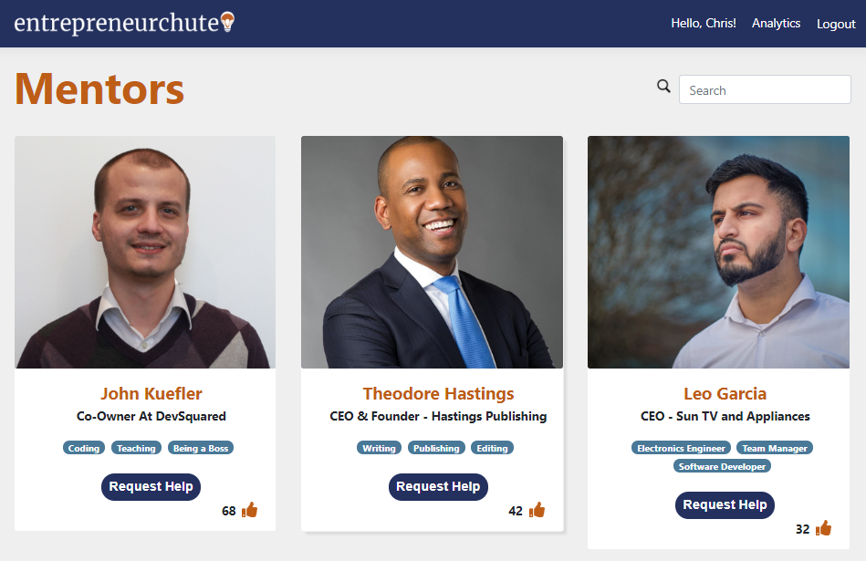

## What is entrepreneurchute?

entrepreneurchute is the latest and greatest technology 
to **connect aspiring entrepreneurs and experienced mentors**. 

Entrepreneurs with specific issues or questions can use entrepreneurchute to collaborate with one of our expert mentors who have the skills they are looking for. Entrepreneurs can request topics for mentorship in which fellow entrepreneurs can join.  Entrepreneurs can then share their experience and recommendation by rating the mentor.

Mentors can collaborate with entrepreneurs to gain a fresh perspective and 
new ideas. They can also discover startup businesses to partner with and gain prestige.

### :grey_question: That's interesting, but what's in it for a mentor like me?
- **Prestige** Mentors get an opportunity to work with people who are searching for their help. They will get a chance to share their experience and be rated based on that expierience.
- **Networking** Mentors will get a chance to work with people with similar interests and expand their brand.
- **Profit** Mentors can offer their services for a fee in any way they would like. Entrepreneurchute simply connects the two parties together!
- **Efficiency** Entrepreneurs are coming to you for help.  And if entrepreneurs have the same questions/problems, then you can work with them together rather than individually.  Additionally, questions/problems will appear based on the number of people joined.
## :open_mouth::open_mouth::open_mouth: That's amazing! but how do I use it?
Easy! just go to this link [**and try it yourself**](https://psu-codeathon.azurewebsites.net/)  
If you are a little more tech oriented, [**You can view our open api here**](https://psu-codeathon.azurewebsites.net/swagger)
## :camera: Screenshots
In a hurry? No worries! We can walk you through it here.
### Mentors Page 
Once an entrepreneur/mentor has logged in, they will be taken to the mentors page.  On this page they can **like** mentors, **request** help, and **search** by name, bio, skills, and title of the mentors.

### Mentoring Requests
After finding the mentor with the skills you are interested in, you can place a request for help or join a current request.
#### Entrepreneur Perspective

#### Mentor Perspective
Mentors can see the requests created by entrepreneurs and send the requesters emails and then complete the request once the entrepreneurs are satisfied.

### Analytics

